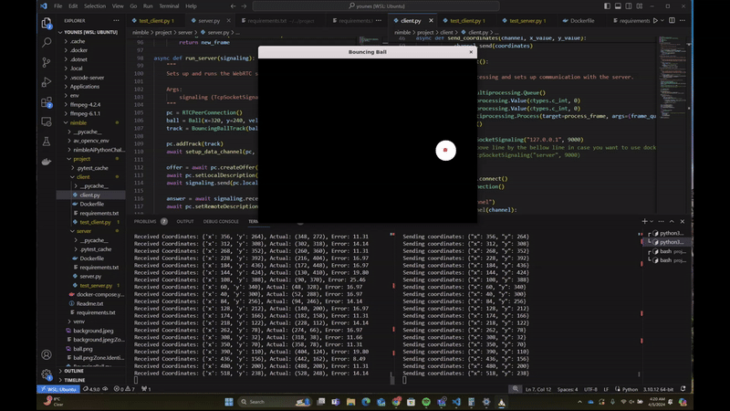

# Real-Time Ball Tracking and Video Streaming with WebRTC

## Important Note

**The actual implementation code for this project has been intentionally hidden due to a Non-Disclosure Agreement (NDA). This README provides an overview of the project structure, features, and challenges faced during development, without revealing proprietary code.**

## Overview

This project implements a real-time bouncing ball tracker using WebRTC for communication between a client and a server. The server generates a video stream of a bouncing ball within a virtual environment, while the client processes this video to track the ball's position. The detected position is then sent back to the server, where it calculates the accuracy of the tracking by comparing the detected position with the actual position of the ball. This project showcases the power of WebRTC for real-time video streaming and data channel communication in a Python environment.

## Features

- **Real-time Video Processing:** Utilizes `aiortc` for real-time video streaming and processing.
- **Ball Position Tracking:** Implements custom logic to detect and track the position of a bouncing ball in the video stream.
- **Accuracy Calculation:** Calculates the error between the detected and actual positions of the ball, demonstrating the accuracy of the tracking algorithm.

## Demo



## Logic Overview

- The **Server** simulates a bouncing ball within a predefined frame, generating frames of a white ball bouncing in black background, and streams this video to the client using WebRTC. It receives the detected position of the ball from the client and calculates the tracking accuracy, providing a simple yet effective way to visualize and understand the dynamics of object tracking in a controlled environment.

- The **Client** receives the video stream, processes each frame to detect the position of the bouncing ball, and sends the detected position back to the server through a WebRTC data channel. The detection process involves converting the video frame to grayscale, applying a binary threshold to isolate the ball based on its brightness, and using contour detection to find the largest white object presumed to be the ball. The ball's center is determined and its coordinates are sent back to the server.

**Watch the Demo**: See the app in action by viewing the demo video in `recording/demo.mp4`.

## Quick Start

### Prerequisites

- Python 3.10
- Docker and Docker Compose (for Docker and Kubernetes deployments)
- Kubernetes cluster (Minikube, k3s, or MicroK8s for local development)
- `aiortc`, `opencv-python`, `numpy`, and other dependencies listed in `requirements.txt`.

### Installation

1. **Create and Activate a Virtual Environment:**

   ```bash
   python3 -m venv venv
   source venv/bin/activate
   ```

2. **Install the Required Dependencies:**
   ```bash
   pip install -r requirements.txt
   ```

### Running the Application

#### Locally

1. **Start the Server:**

   ```bash
   python server/server.py
   ```

   This command launches the server, which begins streaming the video of the bouncing ball.

2. **Run the Client:**
   ```bash
   python client/client.py
   ```
   In a separate terminal, start the client. The client processes the video stream to detect the ball's position and sends this information back to the server.

### Using Docker and Docker Compose

#### Build Docker Images with Docker Compose

For Docker , All references to `127.0.0.1` in the server and client scripts needs to be replaced with `server` for the client to correctly address the server container. (refer to the issue Networking Between Containers at the end of the document)

1. **Build Images:**
   From the root directory of the project, run:
   ```bash
   sudo docker-compose build
   ```

#### Running the Server and Client Separately

After building the images, you can run the server and client containers independently.

1. **Run the Server Container:**
   To start the server in detached mode (running in the background), use:

   ```bash
   sudo docker-compose up -d server
   ```

2. **Run the Client Container:**
   Similarly, to start the client in detached mode, use:
   ```bash
   sudo docker-compose up -d client
   ```

#### Viewing Logs

- **View Server Logs:**

  ```bash
  sudo docker-compose logs server
  ```

- **View Client Logs:**
  ```bash
  sudo docker-compose logs client
  ```

These commands are invaluable for debugging and ensuring that both the server and client are operating as expected within their Docker containers.

#### Using Kubernetes

1. **Start Minikube (or any Kubernetes cluster):**

   ```bash
   minikube start
   ```

2. **Deploy the Server and Client:**

   ```bash
   kubectl apply -f server/server-deployment.yaml
   kubectl apply -f client/client-deployment.yaml
   ```

3. **Monitoring the Deployment:**
   Monitor your deployments with:
   ```bash
   kubectl get pods
   ```
   View logs with:
   ```bash
   kubectl logs <pod-name>
   ```

## Challenges and Solutions

### Compatibility Between OpenCV and aiortc/PyAV

A significant challenge encountered during development was compatibility issues between OpenCV and aiortc, particularly concerning the underlying usage of PyAV, which relies on FFmpeg. This issue manifested as an inability to display images with OpenCV after importing PyAV. The root cause was a conflict in FFmpeg versions expected by OpenCV and PyAV.

**Solution:** After extensive research and debugging, the issue was resolved by installing specific versions of FFmpeg compatible with both libraries. The process involved compiling OpenCV from source, ensuring it was built against these specific FFmpeg versions (4.4.2). Detailed steps for this workaround can be found in a helpful [Stack Overflow discussion](https://stackoverflow.com/questions/72604912/cant-show-image-with-opencv-when-importing-av/72647308#72647308). For future reference and to aid anyone facing similar issues, I've retained the script used for this process (build.sh).

### Docker-related Challenges

#### Networking Between Containers

When deploying the client and server applications using Docker, a common hurdle was establishing communication between the two. By default, each container is isolated and cannot directly access `localhost` of the host machine or other containers.

**Solution:** This was overcome by using Docker's networking capabilities. Specifically, when using Docker Compose, the service names defined in `docker-compose.yml` act as hostnames that can be used for inter-container communication. Therefore, references to `127.0.0.1` in the server and client scripts needs to be replaced with `server` for the client to correctly address the server container.

#### Displaying Images from Containers

Another issue encountered was related to displaying images processed by OpenCV in the client application running within a Docker container. The `cv2.imshow` function requires access to a display, which is not available in a headless Docker container.

**Solution:** The solution involved X11 forwarding to enable GUI applications running in Docker containers to display on the host machine's screen. This setup requires configuring the Docker container to connect to the host's X11 server. An alternative solution for environments where X11 forwarding is not feasible is to save processed images to files and view them outside the container.

### Final Thoughts / Learning Experience

Resolving these issues was a significant learning experience, highlighting the complexities of working with real-time video streaming, containerization, and cross-library compatibility. The solutions implemented not only addressed the immediate problems but also enriched my knowledge and skills in software development and deployment.

It wa a great opportunity for me to for showcasing my ability to quickly learn new concepts, my persistence in solving non-trivial problems.
